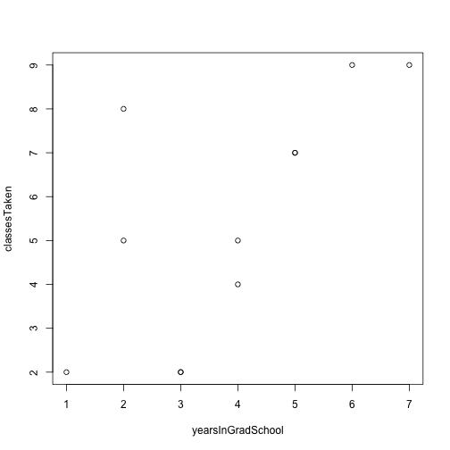
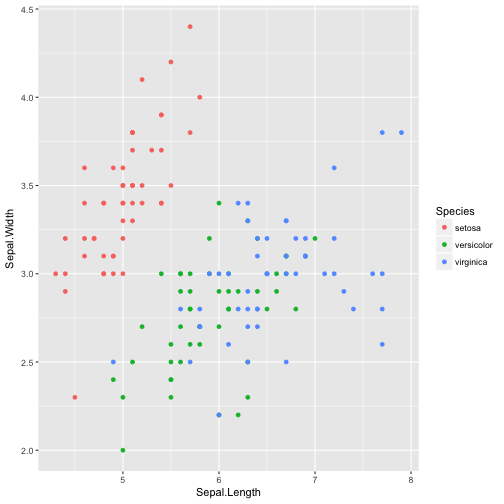
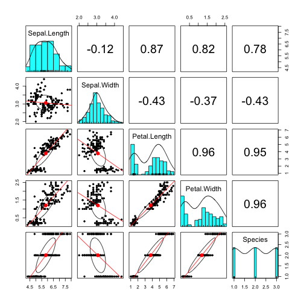

Introduction To R
========================================================
author: David John Baker
date: Autumn, 2017
autosize: true

Overview of Introduction to R
========================================================

- Rationale Behind R and writing scripts/code
- R as Calculator 
- Data Structures
- Manipulating Data
- Tons of Functions 
- Whirlwind R Tour 

Goal Of Session
========================================================

- Learn Basics of R and RStudio
- Practice concepts with simple examples
- Familiarize with vast array of functions
- Have vocabulary and "R" way to think about problem solving


Rationale
========================================================

- Easily reproducible
- Less Human Error in cleaning
- Time invested in programming transfers
- Pretty Graphs
- Open Science 
- Huge integration 


R as Calculator
========================================================

The Console of R is where all the action happens.
You can use it just like you would use a calculator.
Try to do some basic math operations in it. 

- Addition/Subtraction
- Multiplication/Division
- Square roots
- Logical < , >, ==, !=

Making Objects I
========================================================

You don't always want to print your output and retype it in.
Idea is to be very lazy (efficient).
- Save some math to an object with the <- operator, then manipulate that.


```r
foo <- 2 * 3
foo * 6
```

```
[1] 36
```


Making Objects II
========================================================

Notice what has popped up in your environment in RStudio!

Let's get more efficient.


```r
yearsInGradSchool <- c(2,1,4,5,6,7,3,2,4,5,3)
```


Making Objects III
========================================================


```r
yearsInGradSchool * 3
```

```
 [1]  6  3 12 15 18 21  9  6 12 15  9
```

```r
yearsInGradSchool - 2
```

```
 [1]  0 -1  2  3  4  5  1  0  2  3  1
```

Making Objects IV
========================================================


```r
yearsInGradSchool < 2
```

```
 [1] FALSE  TRUE FALSE FALSE FALSE FALSE FALSE FALSE FALSE FALSE FALSE
```


Exploring I
========================================================


```r
mean(yearsInGradSchool)
```

```
[1] 3.818182
```

```r
sd(yearsInGradSchool)
```

```
[1] 1.834022
```

Exploring II
========================================================


```r
mean(yearsInGradSchool)
```

```
[1] 3.818182
```

```r
sd(yearsInGradSchool)
```

```
[1] 1.834022
```

Exploring III
========================================================
What happens when you use ...


```r
hist(yearsInGradSchool)
scale(yearsInGradSchool)
range(yearsInGradSchool)
min(yearsInGradSchool)
class(yearsInGradSchool)
str(yearsInGradSchool)
summary(yearsInGradSchool)
```

Two Objects I
========================================================


```r
yearsInGradSchool <- c(2,1,4,5,6,7,3,2,4,5,3)
classesTaken <- c(5,2,5,7,9,9,2,8,4,7,2)
```

We then pass to a function two arguments, can get auto complete with TAB

```r
cor(yearsInGradSchool,classesTaken)
```

```
[1] 0.6763509
```

Two Objects II
========================================================

- How do you think you would make this **plot**?
- Can you add any arguments to change the axes and the titles?



Iris Data set I
========================================================

- Most common 'practice' data set is the iris data set
- Already preloaded in R
- Try to explore with commands we have used thus far...


```r
str(iris)
class(iris)
summary(iris)
```


Iris Dataset II
========================================================


```
'data.frame':	150 obs. of  5 variables:
 $ Sepal.Length: num  5.1 4.9 4.7 4.6 5 5.4 4.6 5 4.4 4.9 ...
 $ Sepal.Width : num  3.5 3 3.2 3.1 3.6 3.9 3.4 3.4 2.9 3.1 ...
 $ Petal.Length: num  1.4 1.4 1.3 1.5 1.4 1.7 1.4 1.5 1.4 1.5 ...
 $ Petal.Width : num  0.2 0.2 0.2 0.2 0.2 0.4 0.3 0.2 0.2 0.1 ...
 $ Species     : Factor w/ 3 levels "setosa","versicolor",..: 1 1 1 1 1 1 1 1 1 1 ...
```

Iris Dataset III
========================================================

Accessing individual 'columns' is done with the $ operator


```r
iris$Sepal.Length
```

Can you use this to plot the different numeric values against each other?

Iris Dataset IV
========================================================

What would the follow commands do? 


```r
hist(scale(iris$Sepal.Length))


iris$Sepal.Length.scale <- scale(iris$Sepal.Length)
```


Indexing 
========================================================

Let's combine logical indexing with creating new objects.

What do the follow commands do? Why?


```r
iris[1,1]
iris[2,]
iris[,5]
iris[Sepal.Length < 5,]
iris[,c(1:4)]
iris[c(1,2,3,4,5,6,8),c(1:3,5)]
Setosas <- iris[iris$Species == "setosa",]
```

**This could be an entire lecture by itself!!!**

Whirlwind R Tour 
========================================================

- R's power comes in the fact that you download packages to put on top of base R

Packages for 
- Turning Data tables into already formatted APA Latex Tables (stargazer, xtable)
- Creating Publication Quality Graphs (ggplot2)
- Exploring data and not making chart after chart after chart (psych)
- Every statistical test you could want (psych, cars, ezanova, lavaan)
- Software to plot not so normal output (SEMplots)
- Making Websites in R
- These slides were written in R
- Quickly processing huge datasets (data.table, dplyr)
- Tons of Machine Learning

Whirlwind R Tour  
========================================================


```r
library(ggplot2)
ggplot(iris, aes(x = Sepal.Length, y = Sepal.Width, 
                 color = Species), 
       xlab = "Sepal Length",
       ylab = "Sepal Width",
       main = "My Plot") + geom_point()
```



Whirlwind R Tour  
========================================================




Whirlwind R Tour
========================================================

- nlme() and lme4() for Multilevel Modeling 
- lavaan() for Latent Variable Analysis
- ezAnova() for ANOVA based testing; the anova() function does model comparisons
- profileR for Repeated Measures MANOVA
- glm() and lm() for linear models
- caret() for Machine Learning

Resources 
========================================================

- swirl 
- stackoverflow.com 
- Twitter
- Your peers 
- R Community is fantastic (tidyverse!!!)

Future Sessions ? 
========================================================

- Writing functions
- ggplot2  
- Manipulating data (long vs wide / melt vs cast)
- RMarkdown / best Practice for writing code
- Github 
